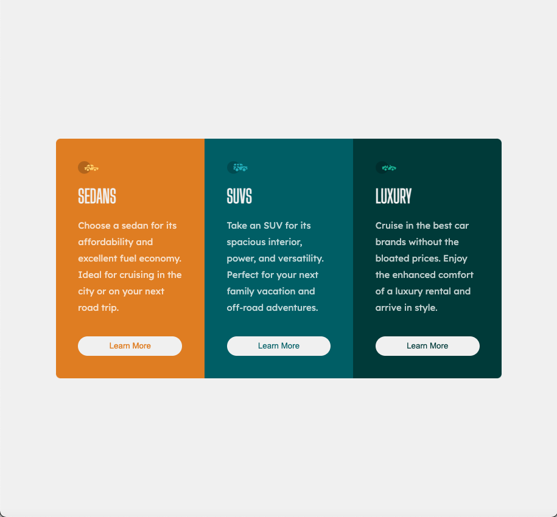

# Frontend Mentor - 3-column preview card component solution

This is a solution to the [3-column preview card component challenge on Frontend Mentor](https://www.frontendmentor.io/challenges/3column-preview-card-component-pH92eAR2-). Frontend Mentor challenges help you improve your coding skills by building realistic projects.

## Table of contents

- [Overview](#overview)
  - [The challenge](#the-challenge)
  - [Screenshot](#screenshot)
  - [Links](#links)
- [My process](#my-process)
  - [Built with](#built-with)
  - [What I learned](#what-i-learned)
  - [Continued development](#continued-development)
  - [Useful resources](#useful-resources)
- [Author](#author)
- [Acknowledgments](#acknowledgments)

**Note: Delete this note and update the table of contents based on what sections you keep.**

## Overview

### The challenge

Users should be able to:

- View the optimal layout depending on their device's screen size
- See hover states for interactive elements

### Screenshot



### Links

- Solution URL: [Add solution URL here](https://your-solution-url.com)
- Live Site URL: [Add live site URL here](https://your-live-site-url.com)

## My process

- The main container should be a flexbox
  - Flex set to one so that each item take equal space
  - flex-wrap:column
- The flex children should stretch to fix the whole space

### Built with

- Semantic HTML5 markup
- CSS custom properties
- Flexbox
- CSS Grid
- Mobile-first workflow

### What I learned

- ```css
  html,
  body {
    width: 100%;
    height: 100%;
  }
  ```
  - set html height to 100% to fill all the page

### Continued development

To make the three buttons align on a line

### Useful resources

- [Flexbox Explained](https://css-tricks.com/snippets/css/a-guide-to-flexbox/) - This is a great tutorial for flexbox!

## Author

- Website - [Haoran Zhang](https://github.com/zhr1996)

## Acknowledgments

Thanks for all the help I received on frontend mentor and my girlfriend who point out my mistake.
